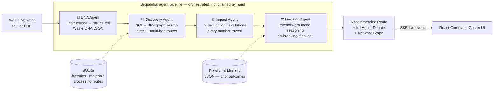

# 🌀 CIRCULO

### The Agentic Industrial Symbiosis Engine

**Four autonomous agents that find out what your factory's "waste" is actually worth — to someone else.**

[](#tech-stack)
[](#tech-stack)
[](#why-deterministic-not-llm-invented)
[](#quickstart)
[](#license)

---

## The 30-second pitch

A cement factory in your city just paid to landfill 20 tonnes of foundry sand this month. Three kilometers away, a glass manufacturer is buying the exact same material — they just need it processed first. **Nobody in the system knew that.**

CIRCULO is a multi-agent system that reads a factory's waste manifest, searches an industrial network for who would take it — directly or after processing — and produces a recommendation with a full, auditable paper trail: every rejection explained, every number traceable to a formula, every decision grounded in real (or realistically simulated) precedent.

It is **not a chatbot.** It is **not a marketplace listing.** It's an autonomous reasoning pipeline — closer to a small ops team of four specialists than a single LLM improvising an answer.

---

## Table of Contents

- [The Problem](#the-problem)
- [The Golden Path — a real walkthrough](#the-golden-path--a-real-walkthrough)
- [Architecture: four agents, one pipeline](#architecture-four-agents-one-pipeline)
- [Why deterministic, not LLM-invented](#why-deterministic-not-llm-invented)
- [What makes this "agentic" and not just a script](#what-makes-this-agentic-and-not-just-a-script)
- [Feature tour](#feature-tour)
- [Tech stack](#tech-stack)
- [Quickstart](#quickstart)
- [Project structure](#project-structure)
- [Build phases](#build-phases)
- [Testing philosophy](#testing-philosophy)
- [Known limitations](#known-limitations--because-honesty-scores-points-too)
- [Roadmap](#roadmap)
- [Team](#team)

---

## The Problem

Industrial symbiosis — one factory's byproduct becoming another's raw material — is a well-understood idea in circular-economy theory. In practice it almost never happens, not because it isn't valuable, but because **nobody has visibility** into who's producing what waste, at what spec, near whom, and who could plausibly use it. The information exists; it's just scattered across factories that have no reason to talk to each other.

CIRCULO is that missing visibility layer, built as an autonomous system rather than a search form — because the interesting part isn't "list nearby factories," it's reasoning through rejection ("this cement plant said no — why?"), discovering indirect paths ("nobody takes it raw, but a processor could transform it into something three other factories want"), and weighing options the way a good ops analyst would ("this option is worth more on paper, but that one has an actual track record").

## The Golden Path — a real walkthrough

This is the exact scenario the system is built to demonstrate, seeded directly into its memory and database:

1. **ABC Foundry** has 20 tonnes/month of Foundry Sand at 12% moisture, 94% purity.
2. **Direct rejection**: Sagar Cement Works (10% moisture limit) and Coastal Cement Ltd (8% moisture limit) both reject it — and the system already knows this has happened before, because it's checking *persistent memory*, not just today's spec sheet.
3. **Multi-hop discovery**: no direct buyer works, so the Discovery Agent's graph search finds a 2-hop path — Dakshina Processing Solutions can dry the sand from 12% down to ~5% moisture, at which point Karavali Glass Industries or Western Glass Co will take it.
4. **The interesting decision**: Western Glass Co's route is worth *more* on paper (~₹30,379 vs ~₹29,566 ecosystem value) — but it's within 2.7% of Karavali's number, and Karavali has a **verified successful prior transaction on record**. The Decision Agent recommends Karavali over the marginally-higher, unproven number — and says exactly why, in plain language, not hidden reasoning.

Every number above — the ecosystem value, the CO2 reduction, the transport cost — is not an LLM guess. It's the output of a pure Python formula, and the UI can show you that formula, its inputs, and a step-by-step breakdown for any figure on screen.

## Architecture: four agents, one pipeline



Each agent is a strict subclass of a shared `BaseAgent` contract: every one is timed, wrapped in a uniform response envelope, and — critically — **a failure in one agent degrades the run instead of crashing the whole pipeline.** If Discovery finds nothing, Impact and Decision are marked `SKIPPED`, not silently broken.

The whole run streams live to the frontend over Server-Sent Events, so the UI shows real agent-by-agent status (`WAITING → RUNNING → COMPLETE`) rather than a spinner hiding four seconds of "trust me."

## Why deterministic, not LLM-invented

**Invariant, enforced in code**: the Impact Agent may *only* ever emit `ExecutionSource.DETERMINISTIC`. No LLM touches a number in this system. Every calculation — transportation cost, material value, avoided disposal cost, CO2 reduction — is a pure Python function, and every result is wrapped in a `TracedValue` carrying its exact formula, its inputs, and a step-by-step breakdown string.

This was a deliberate priority ordering from day one: **reliability > demoability > simplicity > complexity.** The Golden Path must work even if an LLM API is down, the internet drops, or a RAG source fails — because a live demo is the worst possible place to discover your recommendation engine hallucinated a number.

## What makes this "agentic" and not just a script

A fair challenge for any multi-agent project: what's actually agentic here versus a pipeline with good branding? Three concrete answers:

- **Grounded, not just computed, decisions.** The Decision Agent doesn't just pick the highest number — it checks persistent memory for prior outcomes, and when two options are close (within 5% ecosystem value), it explicitly favors the one with a *verified track record* over the marginally-better, unproven one. That's a judgment call, made transparently, and explained in plain language (`debate`) rather than hidden.
- **Autonomous multi-hop discovery.** Nobody tells the system "try Dakshina Processing Solutions." The Discovery Agent runs a bounded graph search that discovers the transformation path on its own — including that a rejection at one node should trigger a search for an intermediate processor, not a dead end.
- **A live what-if simulator that reasons, not just recalculates.** Drag the moisture slider down and the *entire* pipeline re-runs — rejections flip to acceptances, the recommended route changes, the reasoning updates — all without ever contaminating the system's real memory with a hypothetical outcome (a subtle bug we caught and fixed: the Decision Agent's memory writes are now gated so simulations read precedent but never fabricate it).

## Feature tour

| Feature | What it actually does |
|---|---|
| **Real-time agent status rail** | Watch DNA → Discovery → Impact → Decision execute live via Server-Sent Events, not a fake progress bar |
| **PDF or pasted-text manifest input** | Upload a real manifest PDF or paste structured text — both go through the same DNA extraction path |
| **Multi-hop route discovery** | Finds indirect paths through processors when no direct buyer exists, up to 3 hops |
| **Auditable Impact calculations** | Every ₹ and kg CO2e figure ships with its formula, inputs, and breakdown — click to verify, nothing is a black box |
| **Memory-grounded Decision Agent** | Explains every rejection with a concrete reason, cites prior recorded outcomes, and breaks close ties using track record |
| **Interactive Network Graph** | A live force-mapped visualization of the whole candidate network — source, processors, accepted/rejected destinations — built with React Flow |
| **What-If Simulator** | Drag quantity/moisture/purity sliders and watch the recommendation re-derive in real time, with zero risk to persistent memory |
| **Dockerized, one-command deploy** | `docker compose up --build` and the whole stack — seeded database included — is live in under a minute |

## Tech Stack

| Layer | Choice | Why |
|---|---|---|
| Backend | Python 3.11 + FastAPI | Async-native, typed request/response contracts via Pydantic, fast to iterate |
| Orchestration | Custom async pipeline (not LangGraph) | Lower latency, fewer moving parts, easier to debug live on stage — same conceptual shape, fewer black boxes |
| Database | SQLite | Zero-ops for a hackathon timeline; the synthetic industrial network (13 factories, 7 materials, processing routes) seeds in milliseconds |
| Persistent memory | Flat JSON file | Deliberately human-editable between demo runs — no DB tooling needed to inspect or tweak what the system "remembers" |
| Frontend | React 19 + Vite | Fast dev loop, no build-tool ceremony |
| Graph visualization | React Flow (`@xyflow/react`) | Purpose-built for interactive node/edge diagrams, first-class React 19 support |
| Realtime updates | Server-Sent Events | Simpler and more reliable than WebSockets for a one-directional live status stream |
| Containerization | Docker + Docker Compose | One command, reproducible, judge-runnable without touching a Python version manager |

## Quickstart

### Option 1 — Docker (recommended, one command)

```bash
git clone https://github.com/trpzz5/circulo-agentic.git
cd circulo-agentic
docker compose up --build
```

Open **http://localhost:5173**. That's it — the backend seeds its own database on first boot, no manual setup step required.

### Option 2 — Run locally

```bash
# Backend — requires Python 3.11 (not 3.14 — pydantic-core has no
# prebuilt wheel for it yet and will fail to build from source)
cd backend
python3.11 -m venv .venv && source .venv/bin/activate
pip install -r requirements.txt
python -m app.database.seed
uvicorn app.main:app --reload --port 8000

# Frontend, in a second terminal
cd frontend
npm install
npm run dev
```

Open **http://127.0.0.1:5173**. Backend health check: **http://127.0.0.1:8000/api/health**.

### Try the Golden Path

Click **"Load Golden Path Sample"** → set **Max Hops** to **2 — Multi-hop** → click **Run Analysis**. Then try the What-If Simulator: drag the moisture slider down and watch Sagar Cement Works flip from rejected to viable in real time.

## Project Structure

```
backend/
  app/
    agents/          # dna_agent.py · discovery_agent.py · impact_agent.py · decision_agent.py
    api/
      routes/        # health · agents · factories · memory · upload · analyze · simulate
      schemas/       # typed request/response contracts (Pydantic)
    database/        # schema.sql, seed.py — idempotent, safe to run on every boot
    memory/          # memory_store.py + the persistent JSON store itself
    orchestration/    # graph.py — the actual pipeline; run_registry.py — live-run state for SSE
    services/         # PDF parsing, manifest extraction & storage
    tools/            # calculations.py (Impact Agent's pure functions), geo.py, materials.py
  Dockerfile
frontend/
  src/
    components/       # UploadPanel, AgentStatusRail, ActivityTimeline, DecisionSummary,
                       # RouteGraph, WhatIfPanel, HealthBadge
    hooks/usePipeline.js   # owns the entire analysis-run lifecycle
    services/api.js        # one function per backend endpoint
    utils/buildGraph.js    # pure function: agent payloads → graph nodes/edges
  Dockerfile
docker-compose.yml
```

## Build Phases

| # | Phase | Status |
|---|---|---|
| 1 | Scaffold, FastAPI, SQLite, health endpoint | ✅ |
| 2 | Schema, seed data, memory store | ✅ |
| 3 | DNA Agent + PDF parsing | ✅ |
| 4 | Discovery Agent + multi-hop routing | ✅ |
| 5 | Impact Agent + auditable calculation trail | ✅ |
| 6 | Decision Agent + persistent memory | ✅ |
| 7 | Orchestration + real-time SSE events | ✅ |
| 8 | React command-center UI | ✅ |
| 9 | Network graph + What-If simulator | ✅ |

## Testing Philosophy

The three deterministic agents (Discovery, Impact, Decision) are pure functions and SQL queries by design — no network calls, no LLM nondeterminism — which makes them cheap to test exhaustively and exactly where a silent bug would be most damaging in a live demo. `pytest` and `httpx` are already wired into `requirements.txt`; a full unit-test suite for these three agents is the top priority of the in-progress Phase 10, ahead of Docker polish.

## Known Limitations — because honesty scores points too

- **Synthetic data only.** The 13-factory network is a realistic but fictional dataset built to demonstrate the reasoning, not a live integration with real industrial registries.
- **No LLM narration layer yet.** `llm_enabled` exists as a config flag for an optional future "explain this in plainer English" layer, but it's off by default and the system is fully functional — by design — without it.
- **Single-region routing.** The BFS graph search and haversine distance calculations assume one coherent geographic area; nothing yet accounts for cross-border logistics or multi-currency pricing.
- **Automated test coverage is still in progress** (see above) — the deterministic design makes this low-risk to close out, but it isn't closed out yet.

## Roadmap

- Full pytest coverage for the three deterministic agents
- CI pipeline running tests on every push
- Optional LLM narration layer (explicitly opt-in, never in the numeric/decision path)
- Persistent-memory volume option for long-running (non-demo) deployments
- Expand the synthetic network beyond one region


## License

MIT — see `LICENSE`.

---

<p align="center"><i>Built for a hackathon. Engineered like it had to actually work.</i></p>